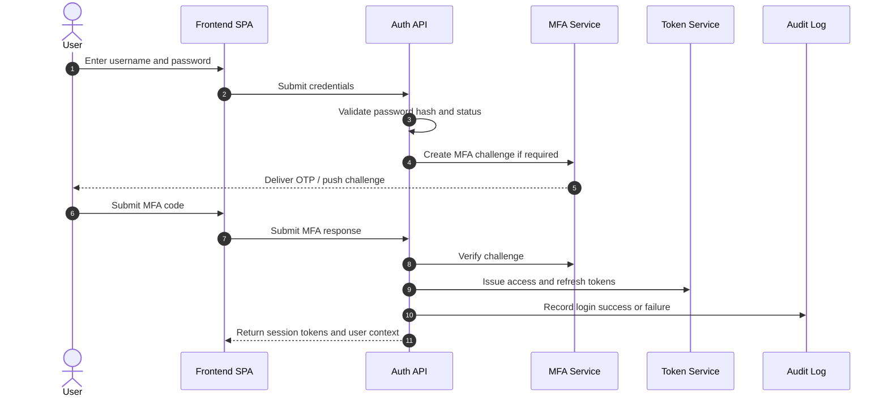
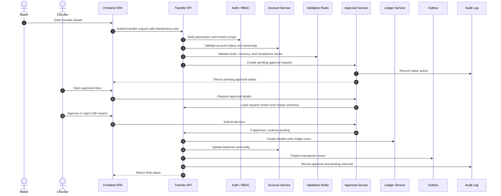
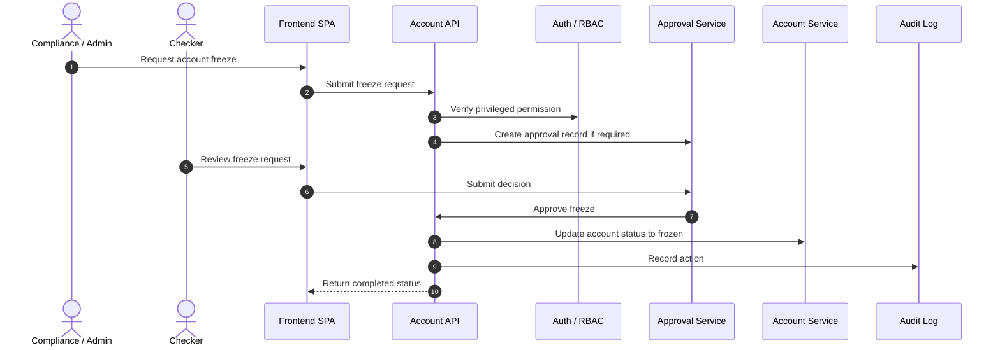

**Outcome:** Detailed plan for a **Core Banking + ERP-lite** app (Spring Boot backend + separate SPA frontend), including AI instructions, use cases, user stories, DB schema, and app flow.

## 1) Problem & Approach

Build a banking operations platform with a classic ERP-style UI, supporting high operational scale (target: ~100K users), strong governance (RBAC, 2FA, maker-checker), and full auditability.  
Architecture: **modular monolith first** (Spring Boot) with clean module boundaries, event/outbox for future microservice split, and SPA frontend consuming secured REST APIs.

---

## 2) Detailed AI Instructions

### Backend AI Instructions (Spring Boot)

**Role:** You are a senior backend engineer building a secure banking core.

**Tech Stack**
1. Java 21, Spring Boot 3.x
2. Spring Web, Spring Security, Spring Data JPA, Validation
3. PostgreSQL
4. Redis (caching, rate limiting, session adjuncts)
5. Kafka/Rabbit optional for async events
6. Flyway for DB migrations
7. OpenAPI/Swagger
8. JUnit + Testcontainers

**Architecture Rules**
1. Use **modular monolith** packages by domain: `customer`, `account`, `transaction`, `ledger`, `approval`, `auth`, `audit`, `reporting`.
2. Enforce domain boundaries (no direct cross-module DB access except via explicit service contracts).
3. Use **hexagonal-ish layering**:
   - API (controllers, DTOs)
   - Application services (use-cases)
   - Domain (entities, rules)
   - Infrastructure (repositories, messaging, integrations)

**Security & Compliance**
1. JWT access + refresh tokens.
2. Mandatory 2FA for privileged actions.
3. RBAC + branch scoping + functional permissions.
4. Maker-checker workflow for critical operations (large transfer, account freeze, role change).
5. Immutable audit log for all CRUD + approvals + auth events.
6. Data encryption:
   - In transit: TLS
   - At rest: DB-level encryption for sensitive fields (PII/account identifiers where needed)
7. Add rate limits and lockout policy on auth endpoints.

**Domain Behavior**
1. Double-entry ledger required for financial posting.
2. No balance mutation without corresponding ledger posting.
3. Idempotency key on transfer/payment APIs.
4. Strong validation: currency consistency, account status checks, daily limits, AML flags hook.
5. Use DB transactions with explicit isolation where needed.

**Reliability & Performance**
1. P95 API latency target for common reads < 300ms (local/dev baseline friendly).
2. Use optimistic locking for concurrent account operations.
3. Add outbox pattern for publishing domain events.
4. Caching for hot reads (customer/account snapshots) with safe invalidation.

**API Standards**
1. Versioned REST APIs: `/api/v1/...`
2. Problem+JSON error responses with machine-readable codes.
3. Pagination/filter/sort for list endpoints.
4. Correlation ID propagated in logs and response headers.

**Testing**
1. Unit tests for domain rules.
2. Integration tests with Testcontainers for DB-backed use-cases.
3. Security tests for role/permission boundaries.
4. Contract tests for critical API responses.

---

### Frontend AI Instructions (Separate SPA, Classic ERP UI)

**Role:** You are a senior frontend engineer building a reliable, classic banking ERP interface.

**Tech Stack**
1. React + TypeScript (or Angular equivalent)
2. State: Redux Toolkit / NgRx (predictable state)
3. UI: classic enterprise component library (table-heavy, form-heavy layout)
4. Routing with role guards
5. i18n-ready strings
6. E2E: Playwright/Cypress

**UX/Design Rules**
1. Classic ERP layout:
   - Left navigation (modules)
   - Top bar (branch/user/context/actions)
   - Dense data grids + advanced filters
2. Prioritize operational clarity over visual novelty.
3. Show status badges (active/frozen/pending-approval/rejected).
4. Always show audit metadata on records (created by/at, last updated).

**Security & Access**
1. Token handling with secure storage strategy.
2. Auto logout on inactivity.
3. 2FA step in login and high-risk actions.
4. Route guards + component-level permission checks.
5. Mask sensitive values by permission.

**Key Screens**
1. Dashboard (KPIs, pending approvals, alerts)
2. Customers
3. Accounts
4. Transfers/Payments
5. General Ledger postings
6. Approval inbox (maker-checker)
7. Audit trail explorer
8. User/Role admin
9. Reports export

**Interaction Rules**
1. Forms must support draft, validation, and server-side error mapping.
2. Risk operations require confirmation modal + reason note.
3. Bulk actions only for authorized roles with explicit confirmation.
4. Optimistic UI only for low-risk non-financial operations.

**Performance**
1. Virtualized tables for large datasets.
2. Debounced server-side filtering.
3. Request cancellation on rapid navigation.
4. Cache reference data (branches, products, roles).

**Quality**
1. Component tests for forms and permission rendering.
2. E2E paths: login+2FA, create transfer + approval, reject flow, audit lookup.
3. Accessibility: keyboard-first navigation and ARIA for core controls.

---

## 3) Use Cases

1. **Onboard Customer**: Create KYC profile, verify identity, assign branch.
2. **Open Account**: Create savings/current account for customer.
3. **Deposit/Withdraw**: Teller executes cash operations with limits.
4. **Internal Transfer**: Move funds between accounts with validations.
5. **Account Freeze/Unfreeze**: Compliance/admin action with approval.
6. **Maker-Checker Approval**: Reviewer approves/rejects pending critical ops.
7. **User & Role Management**: Admin grants scoped permissions.
8. **Audit Investigation**: Compliance searches immutable event logs.
9. **Ledger Reconciliation**: Finance reviews journal entries and balances.
10. **Reporting**: Export operational and financial reports.

---

## 4) User Stories (sample)

1. As a **Teller**, I want to post deposit/withdrawal so branch transactions are recorded accurately.
2. As a **Branch Manager**, I want to approve high-value transfers so risk controls are enforced.
3. As a **Compliance Officer**, I want full audit trails so I can investigate suspicious activity.
4. As an **Operations User**, I want ERP-style filtering and bulk search so I can process records quickly.
5. As an **Admin**, I want RBAC and branch-scoped permissions so users only access allowed features.
6. As a **Checker**, I want maker-checker inbox with diff/context so I can approve safely.
7. As a **Customer Service Agent**, I want account/customer 360 view so I can resolve requests fast.
8. As a **Security Admin**, I want enforced 2FA and login lock policy so unauthorized access is reduced.

---

## 5) Database Schema (High-Level)

**Core Tables**
1. `users` (id, username, email, password_hash, status, mfa_enabled, last_login_at)
2. `roles` (id, name, description)
3. `permissions` (id, code, description)
4. `user_roles` (user_id, role_id)
5. `role_permissions` (role_id, permission_id)
6. `branches` (id, code, name, region, status)
7. `customers` (id, customer_no, full_name, dob, national_id, risk_level, kyc_status, branch_id)
8. `accounts` (id, account_no, customer_id, product_type, currency, status, available_balance, ledger_balance, branch_id, opened_at)
9. `transactions` (id, txn_ref, txn_type, amount, currency, from_account_id, to_account_id, status, idempotency_key, created_by, created_at)
10. `ledger_entries` (id, txn_id, account_id, entry_type[DEBIT/CREDIT], amount, currency, posted_at)
11. `approvals` (id, entity_type, entity_id, action, maker_id, checker_id, status, reason, created_at, decided_at)
12. `audit_logs` (id, actor_id, action, entity_type, entity_id, payload_json, ip_address, correlation_id, created_at)
13. `mfa_challenges` (id, user_id, method, code_hash, expires_at, verified_at)
14. `sessions` (id, user_id, refresh_token_hash, expires_at, revoked_at)

**Indexes/Constraints**
1. Unique: `customer_no`, `account_no`, `txn_ref`, `idempotency_key`
2. FK constraints on all relations
3. Indexes: `accounts(customer_id,status)`, `transactions(created_at,status)`, `approvals(status,created_at)`, `audit_logs(entity_type,entity_id,created_at)`

---

## 6) App Flow (End-to-End)

1. **Login Flow**
   - User submits credentials → backend validates.
   - If MFA required, issue challenge.
   - User submits OTP → receive JWT access/refresh tokens.
2. **Operational Flow (Maker)**
   - Maker creates transaction request (e.g., high-value transfer).
   - System validates limits/status/rules.
   - If critical, set status `PENDING_APPROVAL`, create approval record.
3. **Approval Flow (Checker)**
   - Checker opens approval inbox.
   - Reviews context + account impact.
   - Approves/rejects with mandatory reason.
4. **Posting Flow**
   - On approval, execute atomic posting:
     - Create transaction record
     - Create double-entry ledger rows
     - Update account balances
     - Emit outbox event
5. **Audit Flow**
   - Every significant action writes immutable audit record.
   - Compliance can query by actor/entity/date/correlation ID.
6. **Reporting Flow**
   - Reporting module aggregates transactions/ledger/activity.
   - User exports CSV/PDF by permission.

---

## 7) Suggested Modules (Implementation Plan Structure)

1. Foundation: project setup, auth skeleton, observability baseline
2. Identity & Access: JWT, MFA, RBAC, branch scoping
3. Master Data: branches, users, roles, products
4. Customer & Account Management
5. Transactions + ledger engine (double-entry)
6. Maker-checker approval engine
7. Audit & compliance explorer
8. Reporting & exports
9. Frontend ERP screens and integration
10. Hardening: performance, security tests, reliability checks

---

## 8) ADRs to Create Early

1. ADR-001: Modular Monolith vs Microservices
2. ADR-002: PostgreSQL + Redis choice
3. ADR-003: JWT + MFA + RBAC security model
4. ADR-004: Double-entry ledger design
5. ADR-005: Maker-checker workflow and approval boundaries
6. ADR-006: Outbox/eventing strategy for future scale

---

## 9) SQL Todo Backlog (reflected)

Use these todo IDs/titles/descriptions in your tracker:

1. `architecture-foundation` — Creating architecture foundation and module boundaries  
2. `identity-access` — Implementing JWT, MFA, RBAC, and branch scoping  
3. `master-data` — Building branches, roles, permissions, and user management  
4. `customer-account` — Implementing customer onboarding and account lifecycle  
5. `transaction-ledger` — Building transfers/payments with double-entry posting  
6. `maker-checker` — Implementing approval workflows for critical operations  
7. `audit-compliance` — Building immutable audit logs and compliance queries  
8. `reporting-module` — Implementing operational/financial reporting exports  
9. `frontend-erp-shell` — Building SPA shell, navigation, and role-based routing  
10. `frontend-business-screens` — Implementing customer/account/transaction/approval/audit screens  
11. `integration-hardening` — End-to-end integration, security, and performance hardening

**Dependency chain:**  
`architecture-foundation` → `identity-access` → (`master-data`, `frontend-erp-shell`) → `customer-account` → `transaction-ledger` → `maker-checker` → (`audit-compliance`, `frontend-business-screens`) → `reporting-module` → `integration-hardening`

---

## 10) Sequence Diagrams

### 10.1 Login with MFA

### 10.2 High-Value Transfer with Maker-Checker

### 10.3 Account Freeze Flow

